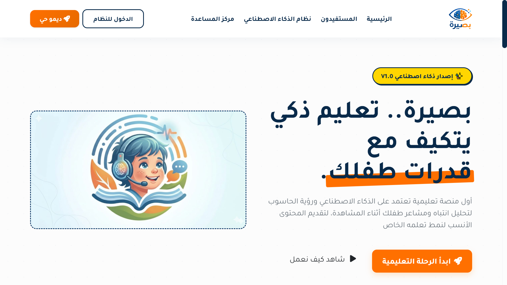

# 👁️ بصيرة | Baseera - Smart AI-Powered Educational Platform


---

## 📖 عن المشروع

**بصيرة (Baseera)** هي منصة تعليمية ذكية متكاملة مخصصة للأطفال من الصف الأول إلى السادس الابتدائي.  
تهدف المنصة إلى إحداث ثورة في مفهوم _التعلم عن بعد_ من خلال دمج تقنيات:

- 🤖 الذكاء الاصطناعي (AI)
- 👁️ الرؤية الحاسوبية (Computer Vision)

وذلك لتحليل سلوك ومشاعر الطفل أثناء التعلم وتخصيص المحتوى التعليمي بما يتناسب مع قدراته الفردية.

---

## 🚀 الرؤية الفلسفية للمشروع

تنتقل "بصيرة" من نظام التعليم التقليدي **ذو الاتجاه الواحد** إلى نظام تعليمي **تكيفي (Adaptive Learning)**.

بدلاً من عرض محتوى ثابت:

- تقوم المنصة بتحليل **تركيز الطفل، الحيرة، الملل**
- تبني **Learning Profile** خاص بكل طفل
- توجهه إلى **أفضل مسار تعليمي مناسب له**

---

## ✨ المميزات الرئيسية (Key Features)

### 👶 وحدة الطالب (Child Module)

- 🗺️ خريطة تعلم ذكية (Pathway) على شكل رحلة تفاعلية
- 🎥 مشغل فيديو تفاعلي (تتبع Pause / Replay / Watch Time)
- 📷 غرفة مشاهدة ذكية مع تحليل المشاعر لحظياً
- ⚡ اختبارات سريعة لقياس الفهم والسرعة

---

### 🧠 محرك الذكاء الاصطناعي (AI Engine)

- 👁️ Facial Emotion Analysis  
  تحليل المشاعر: _(Focus - Boredom - Confusion)_ بدون تخزين فيديو

- 📊 Behavioral Tracking  
  تحويل التفاعل إلى بيانات قابلة للتحليل

- 🎯 Recommendation API  
  اقتراح محتوى مخصص حسب أداء الطالب

---

### 👨‍👩‍👦 لوحة ولي الأمر (Parent Dashboard)

- 📊 تقارير مبسطة غير تقنية
- 📈 متابعة تقدم الطفل
- ⚠️ تحديد نقاط الضعف

---

### 🛠️ لوحة الإدارة (Admin Panel - Filament)

- 🧩 CMS متكامل (صف - مادة - وحدة - درس - فيديو - سؤال)
- 🤖 مراقبة أداء AI
- 🔐 نظام صلاحيات (RBAC) باستخدام Shield

---

## 🛠️ المكدس التقني (Tech Stack)

| المجال      | التقنية                       |
| ----------- | ----------------------------- |
| Backend     | Laravel 11 + PHP 8.2+         |
| Admin Panel | Filament v3 (TALL Stack)      |
| Database    | MySQL                         |
| Frontend    | HTML5, CSS3, Bootstrap 5, RTL |
| Icons       | FontAwesome 6                 |
| AI          | Python (FastAPI)              |
| Auth        | Laravel Sanctum + Shield      |

---

## 📊 بنية قاعدة البيانات (Database Schema)

### 📚 المحتوى التعليمي

- Grades
- Subjects
- Units
- Lessons
- Videos
- Questions

### 🤖 الذكاء الاصطناعي

- BehavioralAnalysis
- LearningProfiles
- Recommendations

### 📈 التفاعل

- VideoInteractions
- QuizResults
- StudentProgress

---

## ⚙️ التثبيت والتشغيل (Installation)

### 1. تحميل المشروع

```bash
git clone https://github.com/your-username/baseera.git
cd baseera
```

### 2. تثبيت الحزم

```bash
composer install
npm install && npm run dev
```

### 3. إعداد البيئة

```bash
cp .env.example .env
php artisan key:generate
```

### 4. إعداد قاعدة البيانات

> تأكد من إنشاء قاعدة بيانات باسم `baseera_db`

```bash
php artisan migrate --seed
```

### 5. إنشاء Super Admin

```bash
php artisan shield:super-admin --user=1
```

### 6. تشغيل المشروع

```bash
php artisan serve
```

---

## 🔒 الخصوصية والأمان (Privacy)

مشروع **بصيرة** يلتزم بحماية بيانات الأطفال:

- ❌ لا يتم تخزين صور أو فيديوهات
- ✅ التحليل يتم لحظياً داخل المتصفح
- 📊 يتم حفظ بيانات رقمية فقط (نسب / إحداثيات)

---

## 📸 Screenshots

> يفضل إضافة صور داخل مجلد `screenshots/`

```
screenshots/
├── landing.png
├── student-dashboard.png
├── admin-panel.png
```

ثم استخدامها هكذا:

```markdown

```

---

## 👨‍💻 الفريق المطور

تم تطوير المشروع بواسطة:

- 👤 Ahmed Eltaroon — Lead Backend Developer

---

## 💡 ملاحظة

> هذا المشروع هو Demo احترافي يوضح دمج  
> **EdTech + AI + Behavioral Analysis**

---

## 📜 الرخصة

MIT License  
© 2026 Baseera Project
